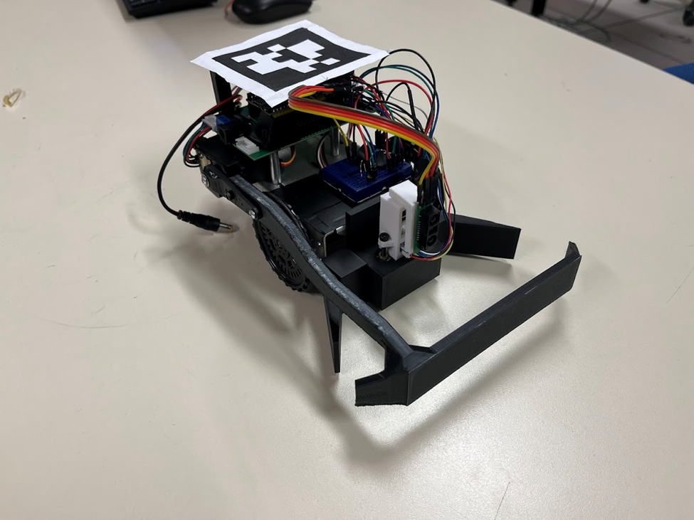
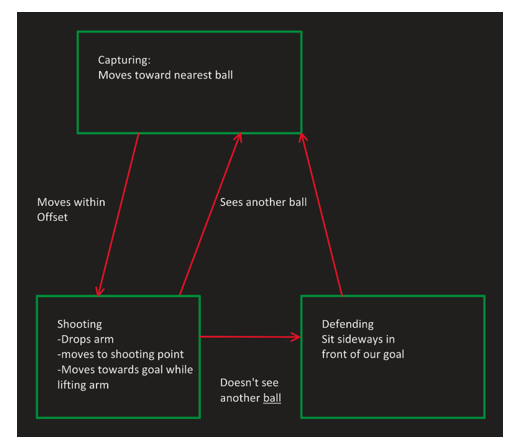
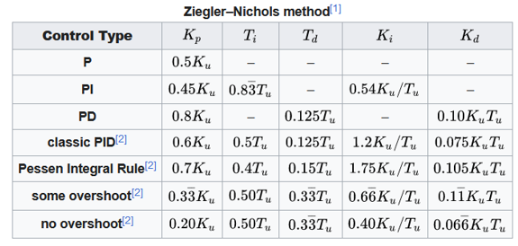
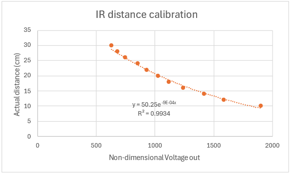
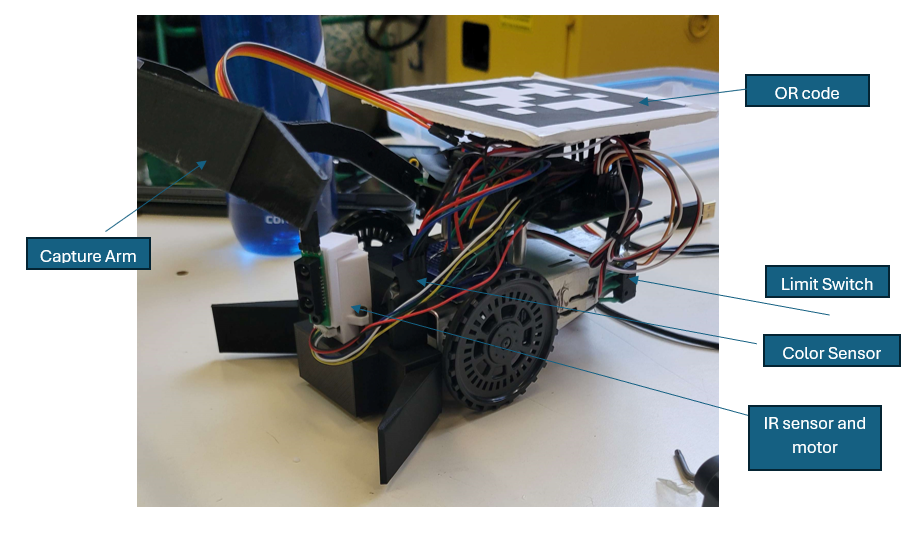

WSU ME401 Midterm Project

Gabriel Szabo, Austin Flood, Zane Young

Section 2

Hardware and Software Used:

\-esp32 microcontroller, PC

\-Visual Studio Code

\-DC motor, IR sensor, Color sensor, Switch, Continuous rotation servos, Positional rotation servo

Here is a picture of our robot, the final iteration of the robot named “Scorpion”. It’s made to play a competition game of “American Soccer”, and park anywhere on field, both made by Professor Perez-Arancibia.

The state machine our robot uses is a little bit more complicated, but a simplified version of it is pictured below. It has the following states:

- Capturing the ball
  - It finds the nearest ball and drives to it. Then when its pointed correctly and close it switches to the shooting state
- Shooting
  - It captures the ball by driving forward and lowering the arm and/or assumes it has captured it (Technically still part of the Capturing state)
  - The Color sensor would double check if we were in the shooting zone (blue or red) before the robot shoots the ball.
  - The robot moves with the ball in front of the goal positioning itself perpendicular to it, then drives forward with the capturing arm open to drive the ball in the goal.
- Defending
  - If the robot doesn’t see any balls on the field, it will move in front of the own goal and position itself parallel to the goal.

Other states that are not shown:

- Avoiding obstacles
  - If IR sees something within its designated flagging range, it triggers the robot to go to avoidance mode. It then turns left or right based on where the obstacle is.
  - The rear switch is set to move the robot forward and left if it is triggered.
- Invalid pose
  - To stop the robot when it wanders off or is not in use, there is a state where if the robot pose is invalid, the robot will stop and do nothing. This is a good feature to have which sadly other teams have not implemented.

IR Sensor rotation tuning:

We tuned our DC encoder motor using the Ziegler-Nichols method. We set our Ki and Kd to 0 at first and then increased Kp until the motor moved. Then we fine the Ki and Kd using the table below.![A table with numbers and symbols

Because the inertia of our setup was so small, our proportional gain was 180 when we first started tuning it. This would mean our Ki would have to be 900 and Kd 2.7 which would make our motor eratic.

We we ended at Kp of 80 but then changed it even lower to 60, Ki at 15 and Kd at 1.5.

IR sensor calibration:

For the IR sensor, we used a best fit equation to convert our non-dimensional voltage into distance. We also used a median filter to filter any extreme values from noise.

Color sensor and calibration:

For the color sensor calibration, we reused the code we made in one of the previous labs. This was done by first getting the values of black and white background against a flashing RGB LED. Then we flashed the same LED at red, green, and blue objects, and the sensor would give us specific values at different colors which we would compare.

Limit Switches:

The limit switch would give a voltage if it was triggered and no voltage if not. We use this to simply switch states if it was triggered to drive forward.

Construction:

In the picture below, you can see our robot construction. It is made from a prefabricated frame. Two continuous rotational servos, one positional servo, the IR sensor and the color sensor which is hard to see (inside the black claw next to DC motor).

These were all made using SolidWorks and 3D printing.

